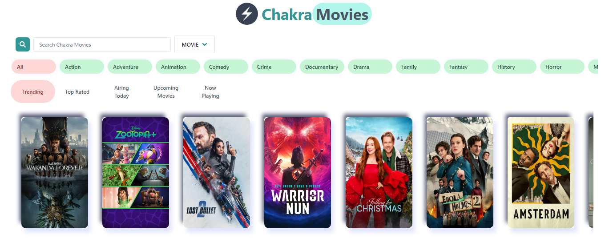

*deployed on vercel*
# Chakra Movies

This is a React / Typescript app to help people search through movies by categories, search for specific movies and preview movie details. Its a simple app to demostrate the basic features of the react library.

## Table of Contents

- [Movie Features](#movie-features)
- [Concepts and Apis Employed](#concepts-and-apis-employed)
- [Built with](#built-with)
- [Live Preview](#live-preview)
- [Required Installations](#required-installations)
- [Installation of This App](#instalation)
- [License](#license)
- [Contact](#contact)
- [Acknowledgements](#acknowledgements)

<!-- Movie featurs -->

## Movie Features

- A user upon visiting the app, sees a list of trending movies with an option to choose a different category or filter according to genre.
- Users can also preview a specific movie to see more details.
- The search feature is optimised by implememting a debounce function. 

<!-- concepts and apis employed -->

## Concepts and APIs Employed

- The API employed for movie information was gotten developed by TMDB [here](https://www.themoviedb.org/).
- Official API documentation for the movie db can be found [here](https://developers.themoviedb.org/3)
- This app demonstrates the use of basic concepts of React Library 
- This app demonstrates the use of basic concepts of React Library: 
  - Modules
  - Components structuring 
  - React Functional component with typescript
  - React hooks (useState, useEffect, useCallback)
  - Custom hooks
- This app also demonstrates the building of basic unit / integration tests with the React Testing Library.

<!-- BUILT wITH -->

## Built with

- HTML5
- Chakra UI
- Typescript
- ES Lint (Air Bnb recomended standard)
- React


## Live Preview

Find the live version [here](https://chakra-movies.vercel.app/).
Below is a screenshot of what it looks like.




<!-- REQUIRED INSTALLATION -->

## Required Installations

- Npm

<!-- INSTALLATION -->

## Installation of This Repository

Once you have installed the required packages shown on the [Required Installations](#required-installations), proceed with the following steps

Clone the Repository

```Shell
your@pc:~$ git clone git@github.com:ugegedaniel/chakra-movies-app.git
```

Move to the downloaded folder

```Shell
your@pc:~$ cd chakra-movies
```

Install all packages

```Shell
your@pc:~$ npm install
```

Open the app

```Shell
your@pc:~$ npm start
```

## License

Distributed under the MIT License. See `LICENSE` for more information.

<!-- CONTACT -->

## Contact

- 🇳🇬  Ugege Daniel - ugege62@gmail.com | [Github Account](https://github.com/ugegedaniel) | [Twitter](https://twitter.com/ugege_daniel) | [Linkedin](https://www.linkedin.com/in/daniel-ugege-50a499227) | 

## Acknowledgements

- <a href="https://www.themoviedb.org/"> TMDB</a> |<a href="https://github.com/frankly034"> Lewis Ugege</a> | God Almighty .
